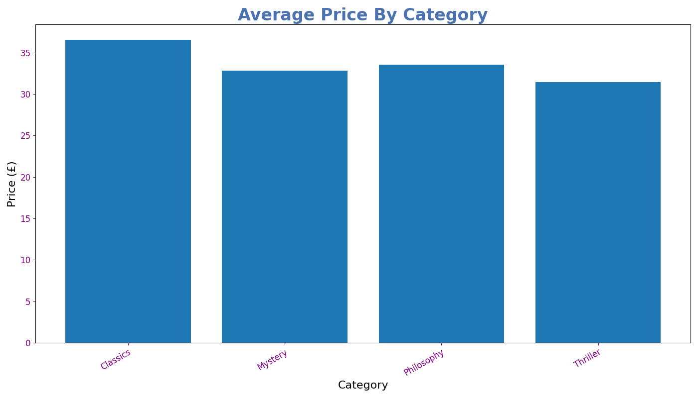
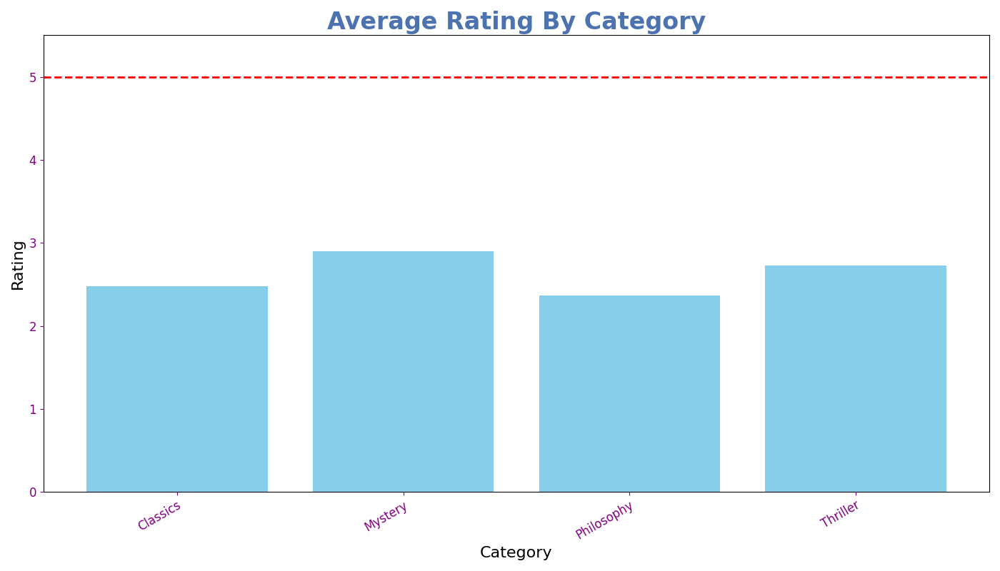

# Multi-Source Book Scraper

A Python pipeline that scrapes book data from multiple categories on 
[books.toscrape.com](http://books.toscrape.com), merges the datasets, 
and generates comparison charts automatically.

---

## Features

- Scrapes title, price, and rating from multiple categories
- Cleans and structures scraped datasets using pandas
- Merges datasets into one unified CSV
- Calculates average category statistics
- Generates 2 comparison charts saved as PNG files

---

### Categories Used

- Mystery
- Classics
- Thriller
- Philosophical

---

## Project Structure

```
multi-source-book-scraper/
│
├── scraper/
│   ├── __init__.py
│   └── books.py            # scrapes books from a given URL and category
│
├── processors/
│   ├── __init__.py
│   ├── cleaner.py          # cleans price and rating columns
│   └── merger.py           # merges multiple dataframes into one
│
├── visualizer/
│   ├── __init__.py
│   └── charts.py           # generates bar charts from merged data
│
├── data/
│   └── combined_books.csv    # full scraped dataset for reference
│
├── screenshots/             # chart previews for README
│   ├── avg_price.png
│   └── avg_rating.png
│
├── main.py                # pipeline entry point
├── output/                # generated at runtime (gitignored)
├── .gitignore
├── requirements.txt
└── README.md
```

---

## How to Run

### Install dependencies
```bash
pip install -r requirements.txt
```

### Run the pipeline
```bash
python main.py
```

---

## Output

Running the pipeline generates the following files in `output/`:
- `combined_books.csv` — full merged dataset (also saved to `data/` for reference)
- `avg_price.png` — average price comparison chart
- `avg_rating.png` — average rating comparison chart

> `output/` is excluded from the repository. Run the script to generate these files locally.

---

## Visualizations

**Average Price by Category**



**Average Rating by Category**



---

## Tech Stack

- Python 3
- lxml
- requests
- BeautifulSoup4
- pandas
- matplotlib

---

## Author

Manish Pandeya
